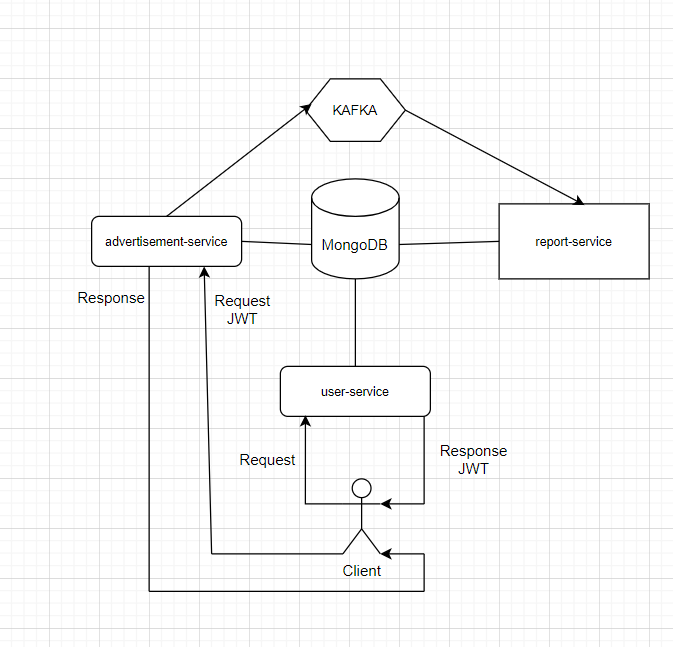

Bir ilan sistemi için, ilan bilgilerini alıp ilan kaydı oluşturan, belli kriterlere göre ilan sorgulamalarının yapılabildiği restful bir uygulamanın Spring Boot framework kullanılarak yazılması,

Gereksinimler:

- Kullanıcıdan ad-soyad, telefon, email, password bilgileri alınarak, kullanıcı kaydı yapılmalıdır.
- Kaydedilen kullanıcının sisteme giriş yapabilmesi için bir authentication servisi bulunmalıdır.(Basic authentication yeterlidir.)
- Sistemde kayıtlı bir yönetici kullanıcı olmalıdır.
- Kullanıcıların ilan kaydı oluşturabildiği ve güncelleyebildiği bir servis bulunmalıdır.
- İlan kaydı oluşturulduktan sonra veya güncellendikten sonra pasif olmalı, yönetici kullanıcı bu ilanı onaylamalı veya reddedebilmelidir. (Onay için servis bulunmalı bu servis yalnızca yönetici kullanıcı tarafından çalıştırılabilmelidir.)
- Oluşturulan ve onaylanan son 10 ilanı listeleyen bir servis olmalıdır.
- Yönetici için, pasif ilanların görüntülenebildiği bir servis olmalıdır.
- Onaylanan ilanlar message queue’ya alınmalıdır.
- Message queue’daki ilanlar raporlama servisi tarafından alınarak her ilan için rapor oluşturulmalıdır. (“... ilanı … kullanıcısı tarafından … gün önce oluşturulmuştur. İlan … kere görüntülenmiştir.” Şeklinde bir metin oluşturulup veritabanına kaydedilebilir. Görüntülenme sayısı için ilan servisinden bilgi alınabilir. Görüntülenme sayısı her istekte bir artırılabilir. ”)
- Raporlama servisi rapor oluşturmak için bir api sunmalıdır. İlan id ile istek yapıldığında oluşturulan rapor güncellenmelidir.
